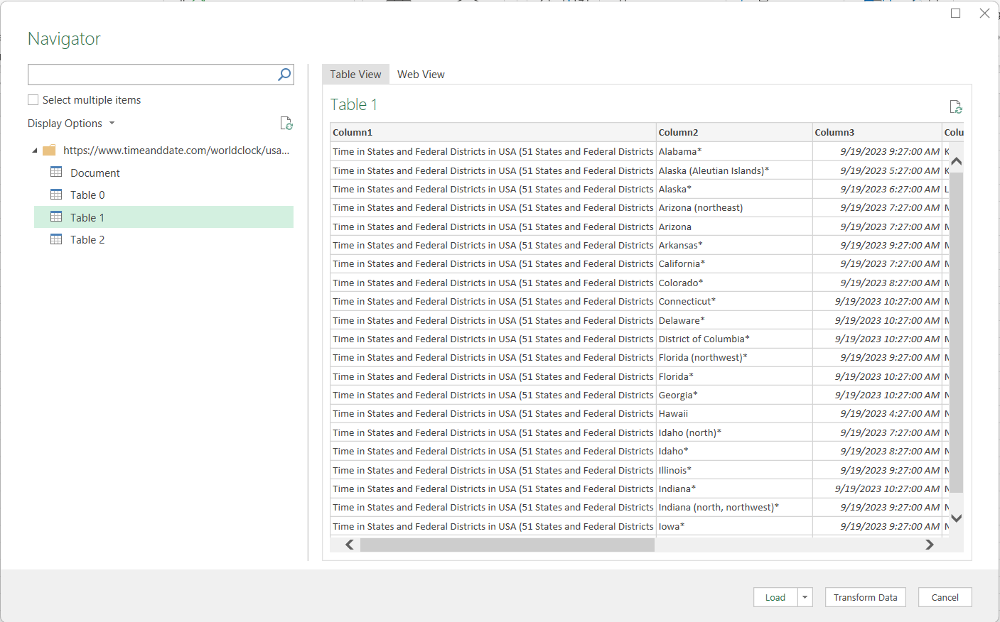

# Scrape Data from Web using Excel
## **Cases and Recommendations**
Choosing Between Excel and Power BI for Web Data Extraction and Analysis

#### Structured Data in Tables
  - *Case*: When websites present data in structured tables.
  - *Points*:
    - Excel: Excel is a suitable choice for small to moderately sized datasets. Its familiar interface and formula capabilities are advantageous for quick calculations and straightforward data manipulations.
    - Power BI: Power BI excels when handling larger datasets or when dynamic and interactive visualizations are needed. It offers powerful visualization tools and can efficiently manage structured data.

#### Unstructured Data or Non-Tabular Data
  - *Case*: When websites do not provide data in tables or present unstructured data.
  - *Points*:
    - Excel: Excel may struggle with web scraping and data extraction when data is not neatly organized in tables. It has limitations in handling unstructured data.
    - Power BI: In cases where websites lack structured tables or contain unstructured data, Power BI is the recommended choice. Its web scraping capabilities, coupled with Power Query, allow users to efficiently transform and clean data, even when it's not presented in tables. Power BI's flexibility makes it versatile for various web data extraction scenarios.

In summary, the choice between Excel and Power BI depends on the nature of the web data and the scale of the analysis. Excel is suitable for smaller, structured datasets, while Power BI shines when dealing with larger datasets, interactive visualizations, and unstructured data on websites. When web scraping is necessary, especially for non-tabular data, Power BI's capabilities make it the preferred tool for efficient data extraction and analysis.

## Steps
#### 1. Open Your Excel File 
Start by opening the Excel file where you want to bring in data from a website.

#### 2. Access the Data Tab
Go to the "Data" tab in Excel.

#### 3. Choose "From Web"
In the "Get & Transform Data" section, select "From Web."

#### 4. Enter the Website URL
A window will pop up. Here, enter the web address (URL) of the website you want to scrape data from, and click "OK." 
e.g.[https://www.timeanddate.com/worldclock/usa](https://www.timeanddate.com/worldclock/usa)

First time it ask how do you want to access the website content - Choose connect (Anonymous)

#### 5. Navigator Window
A new window called the "Navigator" will appear. It displays a list of options on the left and shows a preview of the web page on the right.

#### 6. Web View
On the right side of the Navigator window, you'll find a "Web View" tab. Clicking on it allows you to see the web page as it appears online.

#### 7. Automatic Table Detection
The great thing about this feature is that it can automatically detect tables or documents on the webpage.

#### 8. Select a Table
Click on one of the listed tables, and it will be displayed in a preview window.

#### 9. Table View
If you want to see how the data will look in Excel, switch to the "Table View."

#### 10. Transform Data (Optional)
Before importing the table, you can clean and format it as needed. To do this, click on "Transform Data."

#### 11. Power Query Editor 
This opens the "Power Query Editor," where you can make necessary edits and transformations to the data.

- You can do various transformations using Power Query 

e.g Remove Column

#### 12. Close & Load
After you've finished editing, click "Close & Load." This action loads the table into your Excel sheet.

#### 13. Data in Excel
Finally, after some adjustments and formatting, you'll have the table from the website imported into your Excel sheet.

#### 14. Refresh Data 
To refresh this data click on "Refresh" in Data tab

e.g. You can see time has been updated after Refresh

## Summary
In summary, these steps allow you to easily bring a table from any webpage into Excel for further analysis and use.
