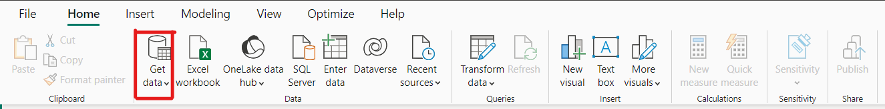
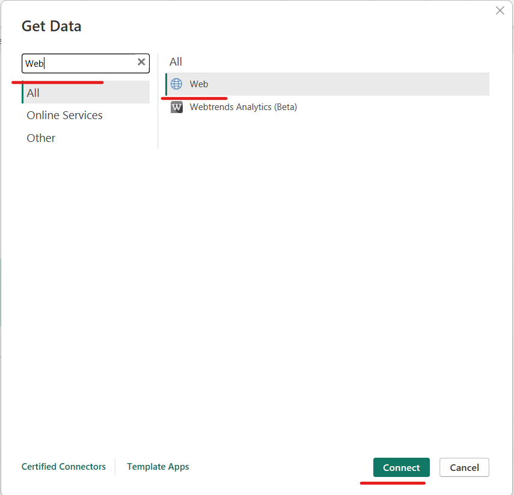
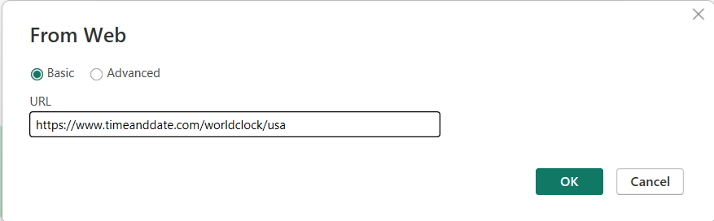
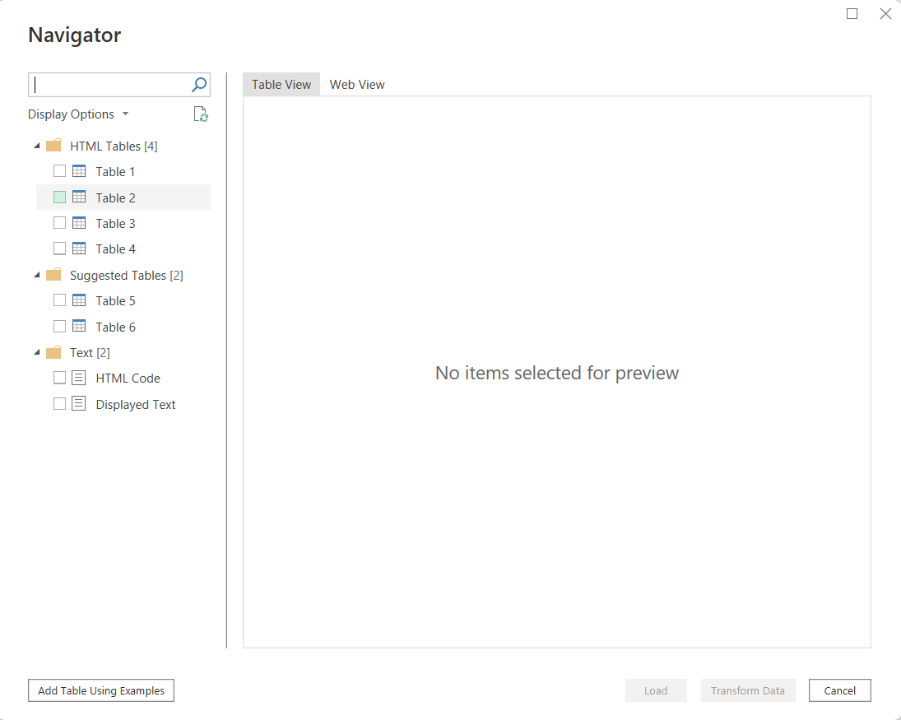
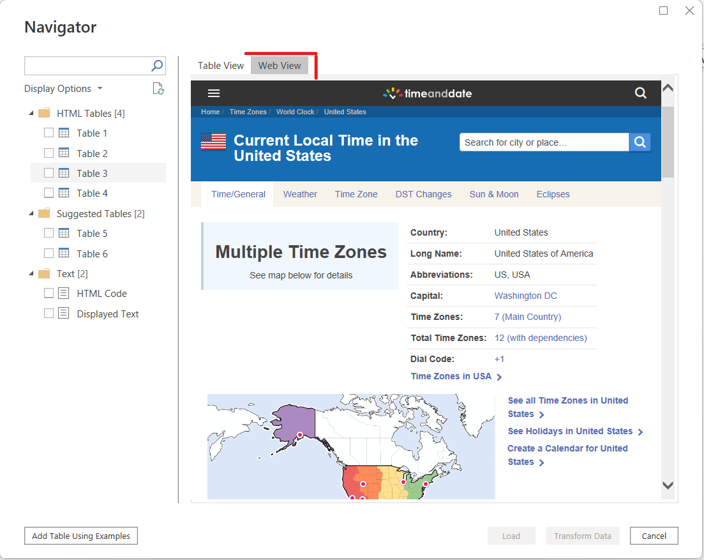
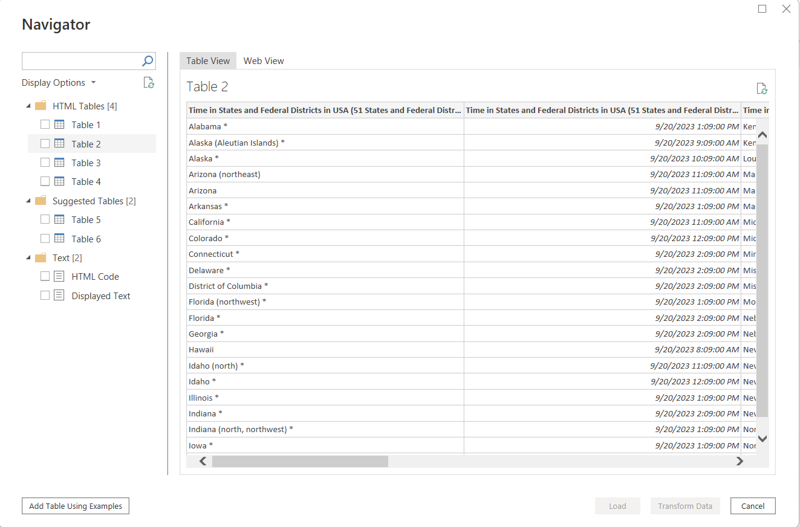
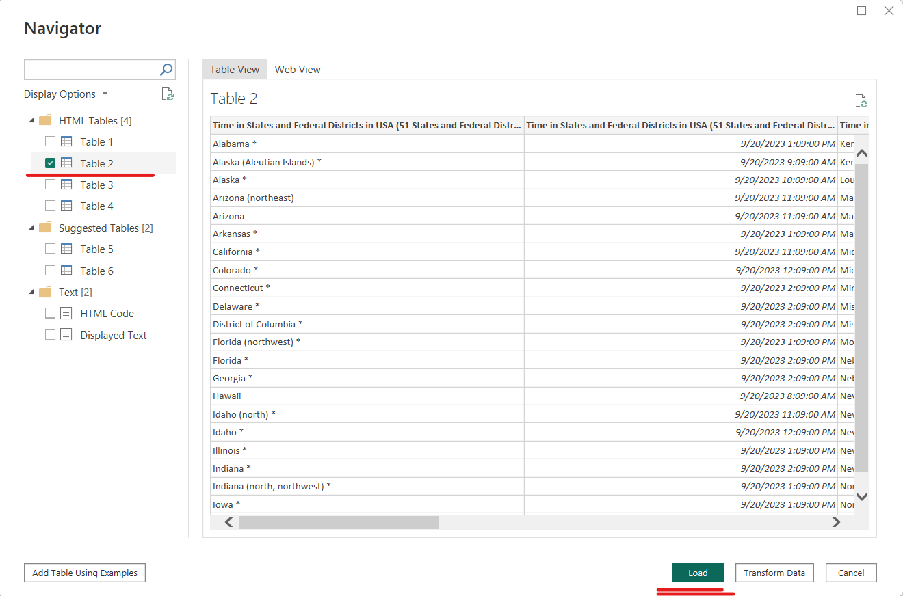
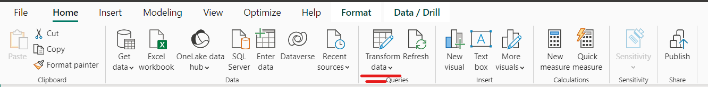
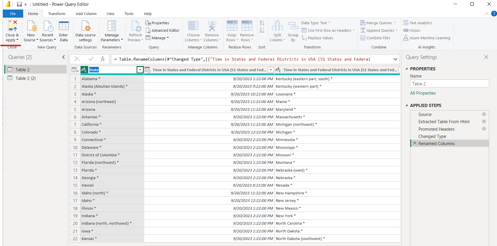
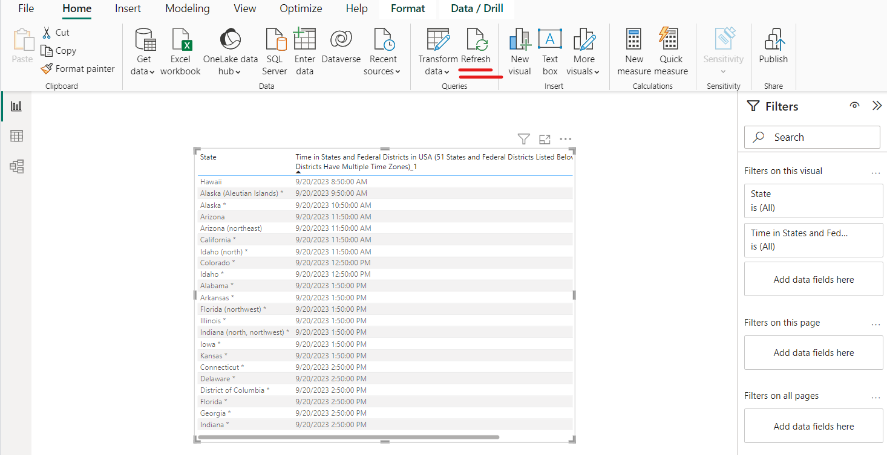

# Scrape Data from Web using Power BI

## Steps

#### 1. Download and Install Power BI
   If you haven't already, download and install Power BI Desktop from the official website: [Download Power BI](https://powerbi.microsoft.com/en-us/desktop/). Start by opening Power BI Desktop, where you will create your data source.

#### 2. Open Power BI Desktop
   After installing, open Power BI Desktop.

#### 3. Click on "Home"
   Navigate to the "Home" tab in Power BI.

#### 4. Choose "Get Data"
   In the "External Data" section, click on "Get Data."
   
   

#### 5. Select "Web"
   In the "Get Data" window, search for and select "Web" as your data source.
   
   

#### 6. Enter the Website URL
   A new window will appear. Enter the web address (URL) of the website you want to scrape data from, and click "OK." 
   
   e.g. [https://www.timeanddate.com/worldclock/usa](https://www.timeanddate.com/worldclock/usa)
   
   

#### 7. Navigator Window
   A new window called the "Navigator" will appear. It displays a list of options on the left and shows a preview of the web page on the right.
   
   

#### 8. Web View
   On the right side of the Navigator window, you'll find a "Web View" tab. Clicking on it allows you to see the web page as it appears online.
   
   

#### 9. Automatic Data Detection
   The great thing about this feature is that it can automatically detect tables or documents on the webpage.

#### 10. Select a Table
    Click on one of the listed tables, and it will be displayed in a preview window.
    
    

#### 11. Load Data
    To import the table, click on "Load" at the bottom right corner of the Navigator window.
    
    

#### 12. Transform Data (Optional)
    After loading the data into Power BI, you can further clean and format it as needed using the Power Query Editor, which is similar to Excel's Power Query.

    - To do this, click on "Edit Queries" under the "Home" tab.
    
    

    - The Power Query Editor will open, where you can make necessary edits and transformations to the data.

#### 13. Close & Apply
    After you've finished editing, click "Close & Apply." This action loads the table into your Power BI data model.
    
    

#### 14. Data in Power BI
    Finally, after some adjustments and formatting, you'll have the table from the website imported into your Power BI data model.

#### 15. Refresh Data
    To refresh this data, click on "Refresh" in the Power BI Desktop. This ensures your data is up-to-date.
    
    

## Summary

In summary, these steps allow you to easily bring a table from any webpage into Power BI for further analysis and visualization.
