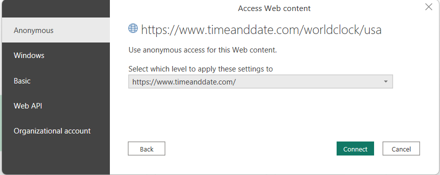

# Scrape Data from Web using Power BI

## **Cases and Recommendations**
Choosing Between Excel and Power BI for Web Data Extraction and Analysis

#### Structured Data in Tables
  - *Case*: When websites present data in structured tables.
  - *Points*:
    - Excel: Excel is a suitable choice for small to moderately sized datasets. Its familiar interface and formula capabilities are advantageous for quick calculations and straightforward data manipulations.
    - Power BI: Power BI excels when handling larger datasets or when dynamic and interactive visualizations are needed. It offers powerful visualization tools and can efficiently manage structured data.

#### Unstructured Data or Non-Tabular Data
  - *Case*: When websites do not provide data in tables or present unstructured data.
  - *Points*:
    - Excel: Excel may struggle with web scraping and data extraction when data is not neatly organized in tables. It has limitations in handling unstructured data.
    - Power BI: In cases where websites lack structured tables or contain unstructured data, Power BI is the recommended choice. Its web scraping capabilities, coupled with Power Query, allow users to efficiently transform and clean data, even when it's not presented in tables. Power BI's flexibility makes it versatile for various web data extraction scenarios.

In summary, the choice between Excel and Power BI depends on the nature of the web data and the scale of the analysis. Excel is suitable for smaller, structured datasets, while Power BI shines when dealing with larger datasets, interactive visualizations, and unstructured data on websites. When web scraping is necessary, especially for non-tabular data, Power BI's capabilities make it the preferred tool for efficient data extraction and analysis.

## **Steps**

#### 1. Download and Install Power BI
   If you haven't already, download and install Power BI Desktop from the official website: [Download Power BI](https://powerbi.microsoft.com/en-us/desktop/). Start by opening Power BI Desktop, where you will create your data source.

#### 2. Open Power BI Desktop
   After installing, open Power BI Desktop.

#### 3. Click on "Home"
   Navigate to the "Home" tab in Power BI.

#### 4. Choose "Get Data"
   In the "External Data" section, click on "Get Data."
   
   
#### 5. Select "Web"
   In the "Get Data" window, search for and select "Web" as your data source.
   
   

#### 6. Enter the Website URL
   A new window will appear. Enter the web address (URL) of the website you want to scrape data from, and click "OK." 
   
   e.g. [https://www.timeanddate.com/worldclock/usa](https://www.timeanddate.com/worldclock/usa)
   
   

   First time it ask how do you want to access the website content - Choose connect (Anonymous)

   
#### 7. Navigator Window
   A new window called the "Navigator" will appear. It displays a list of options on the left and shows a preview of the web page on the right.
   
   Notice PowerBI navigator has button _**Add Table using Examples**_ which is not there in excel navigator and this can be used to scrape unstructured data.
   

#### 8. Web View
   On the right side of the Navigator window, you'll find a "Web View" tab. Clicking on it allows you to see the web page as it appears online.
   
   
#### 9. Automatic Data Detection
   The great thing about this feature is that it can automatically detect tables or documents on the webpage.

#### 10. Select a Table
  Click on one of the listed tables, and it will be displayed in a preview window.
    
  
#### 11. Load Data
  To import the table, click on "Load" at the bottom right corner of the Navigator window.
    
  

#### 12. Transform Data (Optional)
  After loading the data into Power BI, you can further clean and format it as needed using the Power Query Editor, which is similar to Excel's Power Query.

  - To do this, click on "Transform Data" under the "Home" tab.
  
  

  - The Power Query Editor will open, where you can make necessary edits and transformations to the data.

    e.g. Renamed first column by double clicking on column name to state
    

#### 13. Close & Apply
  After you've finished editing, click "Close & Apply." This action loads the table into your Power BI data model.
    
  

#### 14. Data in Power BI
Finally, after some adjustments and formatting, you'll have the table from the website imported into your Power BI data model.

This data can be visualized in multiple ways here is a way to display data in table format 
 
  - Select State and Time from Table 2 model
  - Select visual from Visualization as Table
    
#### 15. Refresh Data
To refresh this data, click on "Refresh" in the Power BI Desktop. This ensures your data is up-to-date.

## Summary

In summary, these steps allow you to easily bring a table from any webpage into Power BI for further analysis and visualization.
