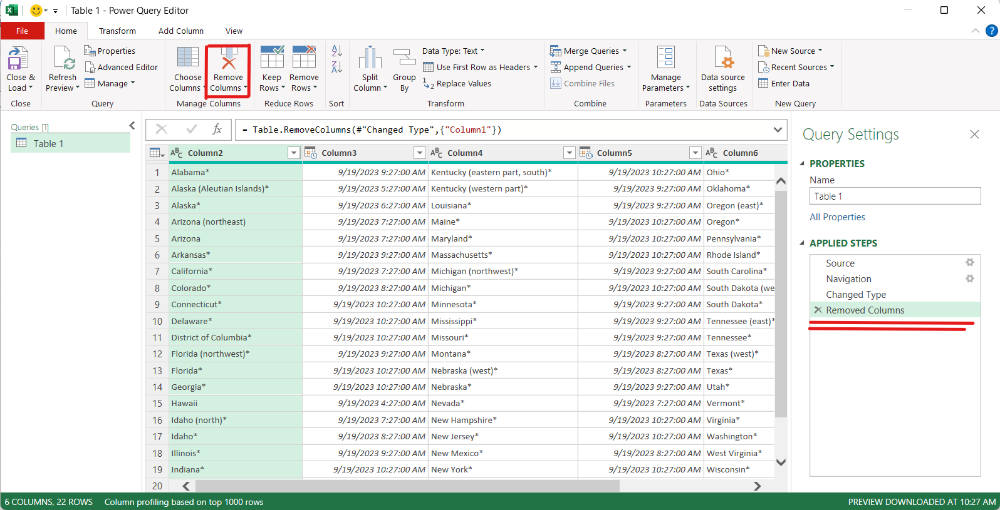

# Scrape Data from Web using Excel

## Steps
#### 1. Open Your Excel File 
Start by opening the Excel file where you want to bring in data from a website.

#### 2. Access the Data Tab
Go to the "Data" tab in Excel.

#### 3. Choose "From Web"
In the "Get & Transform Data" section, select "From Web."

#### 4. Enter the Website URL
A window will pop up. Here, enter the web address (URL) of the website you want to scrape data from, and click "OK." 
e.g.[https://www.timeanddate.com/worldclock/usa](https://www.timeanddate.com/worldclock/usa)

#### 5. Navigator Window
A new window called the "Navigator" will appear. It displays a list of options on the left and shows a preview of the web page on the right.

#### 6. Web View
On the right side of the Navigator window, you'll find a "Web View" tab. Clicking on it allows you to see the web page as it appears online.

#### 7. Automatic Table Detection
The great thing about this feature is that it can automatically detect tables or documents on the webpage.

#### 8. Select a Table
Click on one of the listed tables, and it will be displayed in a preview window.

#### 9. Table View
If you want to see how the data will look in Excel, switch to the "Table View."

#### 10. Transform Data
Before importing the table, you can clean and format it as needed. To do this, click on "Transform Data."

#### 11. Power Query Editor 
This opens the "Power Query Editor," where you can make necessary edits and transformations to the data.

- You can do various transformations using Power Query 

e.g Remove Column

#### 12. Close & Load
After you've finished editing, click "Close & Load." This action loads the table into your Excel sheet.

#### 13. Data in Excel
Finally, after some adjustments and formatting, you'll have the table from the website imported into your Excel sheet.

#### 14. Refresh Data 
To refresh this data click on "Refresh" in Data tab

In summary, these steps allow you to easily bring a table from any webpage into Excel for further analysis and use.
